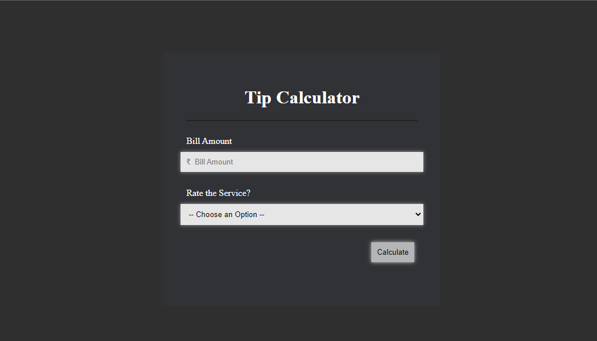

<h1 align="center">Hi 👋, I'm RAMAN RAWAT</h1>

# TIP CLACULATOR
made tip calculator to calculate tip amount based on service

- 🌱 

- 👨‍💻 website link is []


## Screenshot

    
   
   
## Deployment

FOR DIPLOYMENT I USED THE APP NAME AS "NETLIFY"


```bash
  HOST LINK :
```


- 💬 made with **HTML,CSS,JAVASCRIPT**

- 📫 How to reach me **ramanrawatbtl@gmail.com**

- 📄 Know about my experiences [Raman.jpg.pdf](Raman.jpg.pdf)

<h3 align="left">Connect with me:</h3>
<p align="left">
<a href="https://twitter.com/ramanrawat" target="blank"></a>
<a href="https://linkedin.com/in/ramanrawat" target="blank"></a>
<a href="https://fb.com/ramanrawatbtl" target="blank"></a>
<a href="https://instagram.com/ramanrawat60" target="blank"></a>
</p>
<br>
<br>
<h3 align="left">Languages and Tools:</h3>
<p align="left"> <a href="https://www.cprogramming.com/" target="_blank" rel="noreferrer">  </a> <a href="https://www.w3schools.com/cpp/" target="_blank" rel="noreferrer">  </a> <a href="https://www.w3.org/html/" target="_blank" rel="noreferrer">  </a> <a href="https://www.java.com" target="_blank" rel="noreferrer">  </a> </p>

